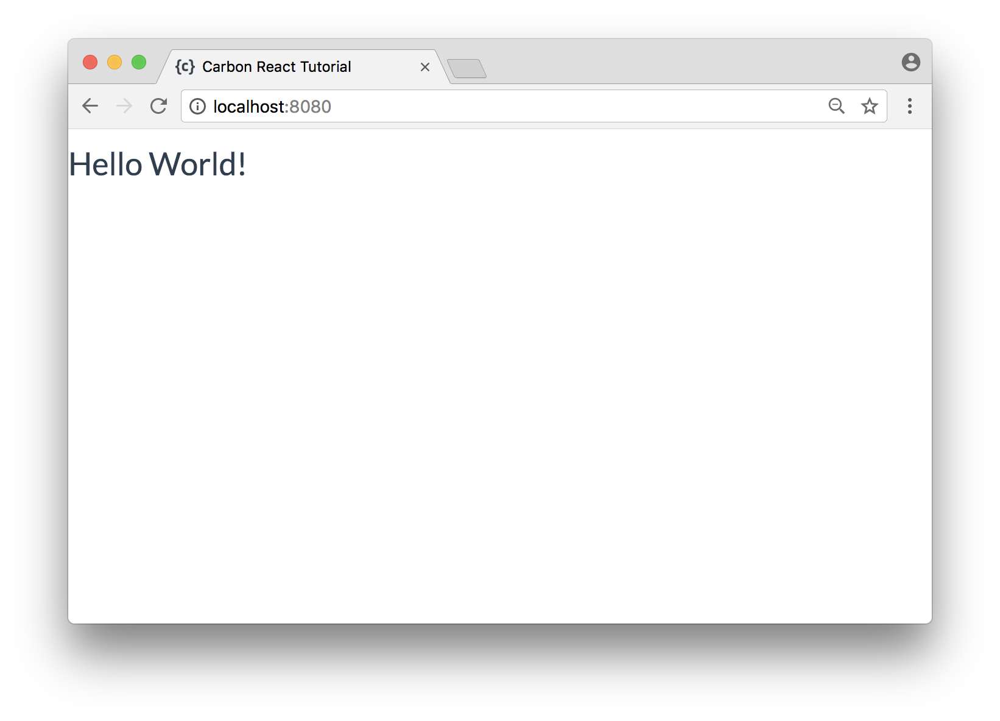

# Building a React App with a Carbon.io API (Part 2)

shield-badge

[](https://travis-ci.org/carbon-io-examples/react-contacts-simple) 


__This is _Part 2_ in a four-part series on how to build a fully-fledged React app. It is intended for developers with a beginner to intermediate knowledge of React who want guidance on how to build a full Single Page Application. We cover app architecture, Redux, user signup/login, routing, and making a NodeJS back-end with Carbon.io.__

| Series Parts |
|---|
| __Part 1:__ [Building an API with Carbon.io](https://github.com/carbon-io-examples/contacts-service-simple) |
| __Part 2:__ __Building a React App with a Carbon.io API__ |
| __Part 3:__ Securing Carbon.io APIs (Coming Soon) |
| __Part 4:__ User Login and Routing with React (Coming Soon) |

## Table of Contents

- [Introduction](#introduction)
- [Set up the Contacts Service](#set-up-the-contacts-service)
- [Directory structure of a React app](#directory-structure-of-a-react-app)
- [Configure React dependencies](#configure-react-dependencies)
- [Set up webpack](#set-up-webpack)
- [Set up a basic React app](#set-up-a-basic-react-app)
- [Manage state with Redux](#manage-state-with-redux)
- [Create a module that talks to the Contacts Service](#create-a-module-that-talks-to-the-contacts-service)
- [Define the action creators](#define-the-action-creators)
- [Define the action types](#define-the-action-types)
- [Define the reducers](#define-the-reducers)
- [Create the store](#create-the-store)
- [Make a component to view contacts](#make-a-component-to-view-contacts)
- [Make a component to create and edit contacts](#make-a-component-to-create-and-edit-contacts)
- [Make a header component](#make-a-header-component)
- [Tie together the components](#tie-together-the-components)
- [Deploying to production environments](#deploying-to-production-environments)
- [Next steps](#next-steps)


## Introduction

In _Part 1_, we created an API with Carbon.io to manage personal contacts. Each contact has a name, email, and some phone numbers. We can create, read, update, and delete contacts from a MongoDB database using this API. In this part we'll show how to use [React](https://facebook.github.io/react/) to implement a web front-end for this API. We will learn how to:

- Architect a React app
- Use Redux for state management
- Talk to APIs such as the Carbon.io API we made in _Part 1_

Some familiarity with React and Redux would be helpful to follow this tutorial. If you're new to these technologies, you may want to check out the [official React tutorial](https://facebook.github.io/react/tutorial/tutorial.html) and this [Redux tutorial from CSS-Tricks](https://css-tricks.com/learning-react-redux/).

Here's the [completed source code](https://github.com/carbon-io-examples/react-contacts-simple) of what we'll be building in this tutorial.


## Set up the Contacts Service

This application is built on top of the [Contact Service API](https://github.com/carbon-io-examples/contacts-service-simple) we built in [_Part 1_](https://github.com/carbon-io-examples/contacts-service-simple). Start the service by running this command from the service's directory:

```
$ node lib/ContactService.js
```

You should see the service start to listen on port 9900.


## Directory structure of a React app

The [source code for this project](https://github.com/carbon-io-examples/react-contacts-simple) is available on GitHub. React is modular by design, so it's important to structure our code in a clear way. Here's a description of the final directory structure of our project so we know what we're working towards:

- `package.json` - project metadata and dependency list.
- `webpack.config.js` - webpack configuration.
- `dist/` - webpack creates this folder when it builds the application. It will contain bundled HTML, JavaScript, styles, and assets that webpack is responsible for building.
- `src/` - all of the project code.
  - `index.html` - base HTML of the application. React Components will be injected into this to create your UI.
  - `styles/` - CSS stylesheets.
  - `js/`
    - `client.js` - entry point of the React application.
    - `components/` - React Components, which let you split the UI into independent reusable pieces.
    - `stores.js` - initialization of the state of the application.
    - `reducers.js` - Redux reducers which manage how the actions change the state.
    - `actions.js` - Redux action creators, which dispatch actions that will send data to reducers to change the state of the application.
    - `Api.js` - code that sends and receives data from the Carbon.io service.

This is a good starting structure for most React applications. As your project grows, you may need to split up your reducers, and actions into multiple files. In that case you should group them into their own folders.


## Configure React dependencies

Most React apps require numerous dependencies to build the application and provide extra functionality. When starting to build larger React apps, it can be hard to know whether you want to use _webpack_ or _Browserify_, what _Babel_ presets to use, or whether you should be using _Flux_, _Redux_, or something else.

We're going to suggest a simple list of dependencies which provides everything we'll need to make a fully-fledged React app. Create a new directory for our React project and copy the following config into a `package.json` file:

```js
{
  "name": "example-react-redux",
  "version": "1.0.0",
  "description": "Example React App",
  "main": "index.js",
  "scripts": {
    "dev": "webpack-dev-server --hot --inline",
    "clean": "rm -rf dist",
    "build": "npm run clean && webpack --progress --colors"
  },
  "author": "",
  "license": "MIT",
  "dependencies": {
    "axios": "^0.16.2",
    "babel-core": "^6.25.0",
    "babel-loader": "^7.1.1",
    "babel-preset-env": "^1.6.0",
    "babel-preset-react": "^6.24.1",
    "babel-preset-stage-0": "^6.3.13",
    "css-loader": "^0.28.7",
    "file-loader": "^1.1.5",
    "react": "^15.6.1",
    "react-dom": "^15.6.1",
    "react-redux": "^5.0.5",
    "redux": "^3.7.2",
    "redux-logger": "^3.0.6",
    "redux-thunk": "^2.2.0",
    "style-loader": "^0.18.2",
    "webpack": "^3.2.0",
    "webpack-dev-server": "^2.5.1"
  }
}

```

What are these dependencies? Some packages have similar prefixes as they're parts of the same technology. Here's a rundown of what they all mean:

- _`axios`_ - a simple library for making HTTP requests. We'll use this to talk to our Contacts API.
- _`babel`_ - a next-generation Javascript compiler. This allows us to use cutting-edge Javascript features in our code and have them compiled to older, browser-compatible Javascript.
- _`react`_ - the basic package required for making a React app.
- _`redux`_ - a popular state management library. We'll learn more about it later.
- _`webpack`_ - a module bundler which is used to build our project. Webpack can do a lot of useful things such as: compiling our code using babel, minimizing our files, and even serving our application.
- _`*-loader`_ - modules that tell webpack how to load different types of files. For example, `style-loader` and `css-loader` help webpack manage our stylesheets.


The `package.json` file also defines a few helpful scripts. `npm run build` will build our `src` folder using webpack and output the built files in the `dist` folder. `npm run dev` will build and serve our project on `localhost:8080` using `webpack-dev-server`. Any time we change a file, `webpack-dev-server` will rebuild and hot-reload our page automatically! This makes development run extremely smooth.

Install all these dependencies using:

```
$ npm install
```


## Set up webpack

Webpack is a powerful tool for building web applications. When webpack processes our source code, it packages all of our JavaScript modules into a minified bundle to be loaded by the browser. We can set up webpack to carry out a wide range of other build tasks such as injecting our stylesheets directly into our HTML files.

Create a file called `webpack.config.js` to contain all of our configuration settings for webpack. Copy the following code into `webpack.config.js`:

```js
const path = require('path');
const webpack = require("webpack");

module.exports = {
  entry: path.join(__dirname, 'src/js/client.js'),
  output: {
    path: path.join(__dirname, 'dist'),
    filename: 'client.bundle.js'
  },
  devtool: 'inline-source-map',
  resolve: {
    extensions: ['.js', '.jsx']
  },
  module: {
    rules: [
      {
        test: /\.jsx?$/,
        exclude: [/node_modules/],
        use: {
          loader: 'babel-loader',
          options: { presets: ['stage-0', 'env', 'react'] }
        }
      },
      {
        test: /index\.html$/,
        use: {
          loader: 'file-loader',
          options: {
            name: '[name].[ext]'
          }
        }
      },
      {
        test: /\.css$/,
        use: [
          'style-loader',
          'css-loader'
        ]
      }
    ]
  },
  devServer: {
    contentBase: path.join(__dirname, 'src')
  },
  plugins: [
    new webpack.EnvironmentPlugin({
      CONTACTS_API_URI: 'http://localhost:9900'
    })
  ]
}
```

This includes all the configuration necessary for webpack to build and serve our application.

The [Environment Plugin](https://webpack.js.org/plugins/environment-plugin/) allows us to reference the `CONTACTS_API_URI` environment variable in our React code. If the `CONTACTS_API_URI` environment variable isn't set, the value passed to the React app will be the default specified in this config (`http://localhost:9900`). Be sure to set this value accordingly, based on the URL that your Contacts API is running at.

To learn in detail about what each of the other config options do, you can check out the [webpack documentation](https://webpack.js.org/configuration/).


## Set up a basic React app

Let's make sure webpack is set up correctly by making a simple React app that just prints "Hello World!" to the screen. Start off by creating the `src` folder:

```
$ mkdir src
```

Now create an `index.html` file in the `src` folder with the following code:

```html
<!DOCTYPE html>
<html>
  <head>
    <meta charset="utf-8">
    <title>Carbon React Tutorial</title>
    <link href="https://maxcdn.bootstrapcdn.com/bootswatch/3.3.7/flatly/bootstrap.min.css" rel="stylesheet"/>
  </head>

  <body>
    <div id="app"></div>
    <script src="client.bundle.js"></script>
  </body>
</html>
```

To style the page, create a `src/styles` folder and download the `main.css` file for the project to style your application. You can use the curl command below or just copy the file from [here](https://github.com/carbon-io-examples/react-contacts-simple/blob/master/src/styles/main.css).

```
$ curl https://raw.githubusercontent.com/carbon-io-examples/react-contacts-simple/master/src/styles/main.css --create-dirs -o src/styles/main.css
```

Next, create the `src/js/components` folder and make an `App.jsx` file there with the following code:

```js
import React from "react"

export default class App extends React.Component {
  render() {
    return (<h1>Hello World!</h1>)
  }
}
```

Then, create a `src/js/client.js` file with the following code:

```js
import React from "react"
import ReactDOM from "react-dom"
import App from "./components/App"
import '../styles/main.css'

ReactDOM.render(<App />, document.getElementById('app'))
```

`client.js` is the entry point of our application. This file and its entire dependency tree will be bundled into `client.bundle.js` by webpack. It will find the element with id `'app'` in `src/index.html` and will render the `App` component inside it.

We also import our `main.css` file here. When using webpack, we can import any type of file we want in our javascript files. We can tell webpack what to do with these non-javascript imports using [loaders](https://webpack.js.org/concepts/loaders/). Our webpack config is set up so that it will inject the CSS into `index.html` when building.

Now if you run `npm run dev` you should see webpack successfully building and serving your application. Navigate to `localhost:8080` and you should see "Hello World!" in your browser. Congratulations! You've created a basic React application.




## Manage state with Redux

Now we're going to start building the front-end for our application. What will the state of our application look like? We want to show a list of contacts, so our application should keep track of an array of all the contacts in our database. We'll also want to be able to select a particular contact so we can edit or delete it.

So our default state will look like this:

```js
{
  contacts: [],
  selectedContact: {
    firstName: '',
    lastName: '',
    email: '',
    phoneMobile: '',
    phoneWork: ''
  }
}
```

`contacts` will hold an array of contact objects from the API. And `selectedContact` will hold a single contact object that has been selected by the user.

We'll be using [Redux](http://redux.js.org/) to manage the state of our application. Redux is a popular tool which is often used with React. It makes managing state in large applications simpler, makes applications easy to debug, and even allows you to "time-travel" back-and-forth between different states of the application. If you're not familiar with Redux, [this](https://css-tricks.com/learning-react-redux/) is a great tutorial.

We'll start by defining Redux _actions_, which define what data we can send to the state. Then we'll define _reducers_, which define the default state of the application and how the actions will update the state.


## Create a module that talks to the Contacts Service

First off, let's create a module that will handle talking to our Contacts Service. Make a `src/js/api.js` file with this code:

```js
import axios from 'axios'

// Basic axios config. Here we're using our CONTACTS_API_URI environment variable that we mentioned while making our webpack config.
axios.defaults.headers.post['Content-Type'] = 'application/json'
axios.defaults.baseURL = process.env.CONTACTS_API_URI

const api = {
  fetchContacts: () => axios({
    method: 'get',
    url: `/contacts`
  }),

  updateContact: (contact) => axios({
    method: 'put',
    url: `/contacts/${contact._id}`,
    data: contact
  }),

  createContact: (contact) => axios({
    method: 'post',
    url: `/contacts`,
    data: contact
  }),

  deleteContact: (contactId) => axios({
    method: 'delete',
    url: `/contacts/${contactId}`
  })
}

export default api
```

This module uses the `axios` package to make HTTP requests to our service. It has methods for creating, reading, updating, and deleting contacts. Calling each of these methods will return a promise which will resolve when the API responds. Our views will dispatch action creators that call these methods to speak to the API.


## Define the action creators

Create `src/js/actions.js`. Add the following code to the file (we'll break it down after):

```js
import api from './api'
import * as types from './actionTypes'

export const selectContact = (contact) => ({
  type: types.SELECT_CONTACT,
  payload: contact
})

export const changeContact = (contactId, contactKey, newContactVal) => ({
  contactId,
  type: types.CHANGE_CONTACT,
  payload: { [contactKey]: newContactVal }
})

export const clearSelectedContact = () => ({
  type: types.CLEAR_SELECTED_CONTACT
})

export const dispatchFetchContacts = (dispatch) => {
  dispatch({ type: types.FETCH_CONTACTS_PENDING })
  return api.fetchContacts().then(
    res => {
      dispatch({ type: types.FETCH_CONTACTS_FULFILLED, payload: res.data })
    },
    err => {
      dispatch({ type: types.FETCH_CONTACTS_FAILED, err })
    }
  )
}

export const dispatchUpdateContact = (contact) => (dispatch) => {
  dispatch({ type: types.UPDATE_CONTACT_PENDING })
  return api.updateContact(contact).then(
    res => {
      dispatch({ type: types.UPDATE_CONTACT_FULFILLED })
    },
    err => {
      dispatch({ type: types.UPDATE_CONTACT_FAILED, err })
    }
  )
}

export const dispatchCreateContact = (contact) => (dispatch) => {
  dispatch({ type: types.CREATE_CONTACT_PENDING })
  return api.createContact(contact).then(
    res => {
      dispatch({ type: types.CREATE_CONTACT_FULFILLED, payload: res.data })
    },
    err => {
      dispatch({ type: types.CREATE_CONTACT_FAILED, err })
    }
  )
}

export const dispatchDeleteContact = (contactId) => (dispatch) => {
  dispatch({ type: types.DELETE_CONTACT_PENDING })
  return api.deleteContact(contactId).then(
    res => {
      dispatch({ type: types.DELETE_CONTACT_FULFILLED, payload: contactId })
    },
    err => {
      dispatch({ type: types.DELETE_CONTACT_FAILED, err })
    }
  )
}
```

This file contains _action creators_, which either return action objects, or take in a dispatch function as an argument and dispatch actions themselves.

Action creators like `selectContact` and `changeContact` simply return an action object. An action object must always have a `type` property so the reducer knows how to deal with it. The `type` is a string constant which we choose to describe the action such as `'SELECT_CONTACT'` or `'CHANGE_CONTACT'`. Action objects can also contain data that is necessary for updating the state, such as the ID of the contact to select.

However, action creators that talk to the API can't just return an action object. Since querying the API is asynchronous, we can't immediately dispatch an action with the result of the API call. We need to dispatch the action once the API responds.

For any API requests, we'll want to set up three actions:

- An action telling the reducer the request began
- An action for when the request is successful
- An action when the request has an error

Take `dispatchFetchContacts` as an example. This action creator will dispatch `'FETCH_CONTACTS_PENDING'` as soon as it's called. Then it will query the API. Once it receives a response, it will dispatch `'FETCH_CONTACTS_FULFILLED'` and send the data to the reducer. If there is an error, it will dispatch `'FETCH_CONTACTS_FAILED'` instead and send the error to the reducer.

Action creators which dispatch actions themselves are known as a _thunks_. To make thunks work with Redux, we have to use the [Redux Thunk middleware](https://github.com/gaearon/redux-thunk). It is the standard way of making asynchronous action creators in Redux. You can read more about how to use asynchronous actions in the [Redux documentation](http://redux.js.org/docs/advanced/AsyncActions.html).


## Define the action types

Our `src/actions.js` file imports from `src/js/actionTypes.js`. This is where we define our action types. Typically, action types should be defined as string constants. One of the biggest benefits of doing this is that if you make a typo when importing an action constant, Redux will throw an error instead of silently running incorrect code. This makes it easier to find mistakes sooner. There are several other advantages which you can read about in the [Redux documentation](http://redux.js.org/docs/recipes/ReducingBoilerplate.html#actions).

Create `src/js/actionTypes.js` and define all of the action types for our application:

```js
export const SELECT_CONTACT = 'SELECT_CONTACT'
export const CHANGE_CONTACT = 'CHANGE_CONTACT'
export const CLEAR_SELECTED_CONTACT = 'CLEAR_SELECTED_CONTACT'

export const FETCH_CONTACTS_PENDING = 'FETCH_CONTACTS_PENDING'
export const FETCH_CONTACTS_FULFILLED = 'FETCH_CONTACTS_FULFILLED'
export const FETCH_CONTACTS_FAILED = 'FETCH_CONTACTS_FAILED'

export const UPDATE_CONTACT_PENDING = 'UPDATE_CONTACT_PENDING'
export const UPDATE_CONTACT_FULFILLED = 'UPDATE_CONTACT_FULFILLED'
export const UPDATE_CONTACT_FAILED = 'UPDATE_CONTACT_FAILED'

export const CREATE_CONTACT_PENDING = 'CREATE_CONTACT_PENDING'
export const CREATE_CONTACT_FULFILLED = 'CREATE_CONTACT_FULFILLED'
export const CREATE_CONTACT_FAILED = 'CREATE_CONTACT_FAILED'

export const DELETE_CONTACT_PENDING = 'DELETE_CONTACT_PENDING'
export const DELETE_CONTACT_FULFILLED = 'DELETE_CONTACT_FULFILLED'
export const DELETE_CONTACT_FAILED = 'DELETE_CONTACT_FAILED'
```


## Define the reducers

Now that we have all the actions our application may want to dispatch, let's create reducers to define how our actions will change the state. A reducer is a function that takes in the current state of the application and an action to return to you a new state. Copy the following code into `src/js/reducers.js`:

```js
import { combineReducers } from 'redux'
import * as types from './actionTypes'

const emptyContact = {
  firstName: '',
  lastName: '',
  email: '',
  phoneMobile: '',
  phoneWork: ''
}

const selectedContact = (state = emptyContact, action) => {
  switch (action.type) {
    case types.SELECT_CONTACT:
      return action.payload

    case types.CHANGE_CONTACT:
      return { ...state, ...action.payload }

    case types.CREATE_CONTACT_FULFILLED:
      return action.payload

    case types.DELETE_CONTACT_FULFILLED:
      return emptyContact

    case types.CLEAR_SELECTED_CONTACT:
      return emptyContact

    default:
      return state
  }
}

const contacts = (state = [], action) => {
  switch (action.type) {
    case types.FETCH_CONTACTS_FULFILLED:
      return action.payload

    case types.CHANGE_CONTACT:
      return state.map((c) => {
        if (c._id === action.contactId) {
          return { ...c, ...action.payload };
        }
        return c;
      });

    case types.CREATE_CONTACT_FULFILLED:
      return [...state, action.payload]

    case types.DELETE_CONTACT_FULFILLED:
      return state.filter((c) => c._id !== action.payload)

    default:
      return state
  }
}

export default combineReducers({
  selectedContact,
  contacts
})
```

This file will create a state with this shape:

```js
{
  contacts: [],
  selectedContact: {
    firstName: '',
    lastName: '',
    email: '',
    phoneMobile: '',
    phoneWork: ''
  }
}
```

The `selectedContact` reducer manages the `selectedContact` part of the state. When creating a reducer that is going to be combined using `combineReducers`, we must specify a default for the part of the state each reducer is managing (here, `selectedContact = emptyContact`). We then create a reducer for `contacts`. The default value of contacts is just an empty array. Finally we combine our reducers and export them using `combineReducers`.

Note we haven't added cases for all action types. Since we're not changing the state for some action types, we'll let these actions be handled by the default case. It's still important to dispatch actions that have no effect like `FETCH_CONTACTS_PENDING`. They will be logged to the browser console when they're dispatched, which is useful for debugging.


## Create the store

Now let's use our reducers to create the store. The store is what ties together the state of the application. The store holds the state, gives access to it via `store.getState()`, and allows the state to be updated via `store.dispatch(action)`. Copy the following code into `src/js/store.js`:

```js
import { createStore, applyMiddleware } from 'redux'
import { createLogger } from 'redux-logger'
import thunk from 'redux-thunk'
import reducers from './reducers'
import { dispatchFetchContacts } from './actions'

const middleware = applyMiddleware(createLogger(), thunk)
const store = createStore(reducers, middleware)

// We want to query the API for all the contacts as soon as our store is created.
store.dispatch(dispatchFetchContacts)

export default store
```

We import two middleware functions: `redux-logger` which allows us to see changes to our state in the browser console, and `thunk` which allows us to use thunks as action creators. We create the store by passing our reducers and middleware to the `createStore` function. We then dispatch `dispatchFetchContacts` to populate our store with the data from our Contacts Service.


## Make a component to view contacts

We've set up the Redux store and actions that will talk to the Carbon.io service, but we need some way to render the state to the screen. So let's make a component to render the contacts. Create a new file `src/js/components/Contacts.jsx`. Let's take a look at all the code for this file then we can break it down afterwards:

```js
// Import the connect method from Redux. This will allow us to connect our store to the component.
import { connect } from 'react-redux'
import React from "react"
import { selectContact, clearSelectedContact } from '../actions'

// Create the ContactsView component. This will render a list of contacts. It is a "presentational" or "dumb" component.
export class ContactsView extends React.Component {
  render() {
    const { contacts, selectedContactId, handleSelectContact, handleClearSelectedContact } = this.props
    return (
      <div>
        <section className="contact-list col-md-6">
          <div className="contact-list-top">
            <h3 className="contact-list-top--title">Contacts</h3>
            { selectedContactId &&
              <button className="btn btn-primary btn-sm" onClick={handleClearSelectedContact}>+ Add Contact</button>
            }
          </div>

          <ul className="contact-list--list">
            {
              contacts.length
                ? contacts.map((contact) => this.renderListItem(contact, selectedContactId, handleSelectContact))
                : <li className="contact-list--list-item m-empty">You have not added any contacts, yet.</li>
            }
          </ul>
        </section>
      </div>
    );
  }

  renderListItem(contact, selectedContactId, handleSelectContact) {
    // If the _id of selectedContact is the same as this contact's _id, give this contact the s-selected class.
    const { _id, firstName, lastName } = contact
    const selectedClass = selectedContactId === _id ? "s-selected" : ""

    // We call handleSelectContact whenever an li is clicked. This will select the contact whose li was clicked.
    return (
      <li
        key={_id}
        className={`contact-list--list-item ${selectedClass}`}
        onClick={(e) => handleSelectContact(contact)} >
        {`${firstName} ${lastName}`}
      </li>
    )
  }
}

// The mapStateToProps function defines how to bind the state and the props of our ContactsView component together.
const mapStateToProps = (state) => ({
  contacts: state.contacts,
  selectedContactId: state.selectedContact._id
})

// The mapDispatchToProps function maps action creators to our presentational component's props.
const mapDispatchToProps = (dispatch) => ({
  handleSelectContact(contact) {
    dispatch(selectContact(contact))
  },
  handleClearSelectedContact() {
    dispatch(clearSelectedContact())
  }
})

// Use the connect method to create a "container" component. This will handle taking in the state and sending it to the presentational component's props.
const Contacts = connect(
  mapStateToProps,
  mapDispatchToProps
)(ContactsView)

// export the container component
export default Contacts
```

This view will render a list of the contacts in our state. If we click on a contact, that contact will be made the `selectedContact` in the state. We also render a _Add Contact_ button which will clear the selected contact when clicked.

We import React, the `connect` method from Redux, and some action creators. We then create a React Component called `ContactsView`. This component is a _presentational component_. It knows nothing about Redux and just renders based on whatever its props are. We want a way of mapping the state to those props. To do that we create a _container component_ called `Contacts` using the `connect` method we imported. We define a function `mapStateToProps` which will say how to bind the state and props together. We also define a function `mapDispatchToProps` which says how to bind our action creators and props together. We pass these functions into `connect` to make our container component and export it since that's the one which is able to read from the state.

You can read more about presentational and container components in the [Redux documentation](http://redux.js.org/docs/basics/UsageWithReact.html#presentational-and-container-components).


## Make a component to create and edit contacts

Now that we can select contacts in a list of contacts, let's create a form where we can view the selected contact's details and update them. To render this, we'll create a new React Component called `Form`. Make the file `src/js/components/Form.jsx`. Here's what the file should look like. We'll break it down afterwards.

```js
import React from "react"
import { connect } from 'react-redux'
import { changeContact, dispatchCreateContact, dispatchUpdateContact, dispatchDeleteContact } from '../actions'

// Define display names for the properties of contacts
const DISPLAY_NAMES = {
  'firstName': 'First Name',
  'lastName': 'Last Name',
  'email': 'Email',
  'phoneMobile': 'Mobile',
  'phoneWork': 'Work',
  'phoneHome': 'Home'
}

// Create a presentational component which will display the details of the selected contact in a form.
export class FormView extends React.Component {
  render() {
    const { contact, handleUpdateContact, handleCreateContact, handleDeleteContact } = this.props

    const contactFields = contact ? Object.keys(contact) : []

    // Handlers for creating, updating, and deleting contacts
    const submitUpdate = (e) => {
      e.preventDefault()
      handleUpdateContact(contact)
    }

    const submitCreate = (e) => {
      e.preventDefault()
      handleCreateContact(contact)
    }

    const submitDelete = (e) => {
      e.preventDefault()
      handleDeleteContact(contact._id)
    }

    return (
      <form onSubmit={contact._id ? submitUpdate : submitCreate} className="contact-form col-md-6">
        <div className="contact-form-top">
          <h3 className="contact-form-top--title">{contact._id ? "Update" : "Create"}</h3>
        </div>

        <div className='editable-view'>
          { contactFields
              .filter(field => field !== '_id')
              .map(field => this.renderInput(field)) }
          <div className="button-bar">
            { contact._id && <button key="Delete" className="btn btn-danger pull-left" onClick={submitDelete}>Delete</button> }

              <button type="submit" className="btn btn-primary pull-right">{contact._id ? "Update" : "Create"}</button>
          </div>
        </div>
      </form>
    )
  }

  renderInput(field) {
    // Define a handler that will be called when an input is edited
    const { handleChangeContact, contact } = this.props
    const changeHandler = (e) => {
      handleChangeContact(contact._id, field, e.target.value)
    }

    // Call changeHandler onChange
    return (
      <div className="form-group" key={field}>
      <label className="form-label">{DISPLAY_NAMES[field]}</label>
      <input
        className="form-control"
        placeholder={DISPLAY_NAMES[field]}
        name={field}
        value={contact[field]}
        type="text"
        onChange={changeHandler} />
      </div>
    )
  }
}

// The mapStateToProps function defines how to bind the state and the props of our ContactsView component together.
const mapStateToProps = (state) => ({
  contact: state.selectedContact
})

// The mapDispatchToProps function maps action creators to our presentational component's props.
const mapDispatchToProps = (dispatch) => ({
  handleChangeContact(contactId, key, val) {
    dispatch(changeContact(contactId, key, val))
  },
  handleCreateContact(contact) {
    dispatch(dispatchCreateContact(contact))
  },
  handleUpdateContact(contact) {
    dispatch(dispatchUpdateContact(contact))
  },
  handleDeleteContact(contactId) {
    dispatch(dispatchDeleteContact(contactId))
  }
})


const Form = connect(
  mapStateToProps,
  mapDispatchToProps
)(FormView)

export default Form
```

This follows a very similar structure to our `Contacts` view.

We start by defining some display names for the properties of the contacts. We'll use these as labels for our form fields. Then we create a presentational component, `FormView`, which will display the details of the selected contact in a form. We're displaying it in a form so that we can easily update contacts by changing the form's fields and submitting the form.

If no contact is selected, submitting the form will create a new contact. If a contact is selected, submitting the form will update that contact and there will be a delete button.

Like with `ContactsView`, `FormView` is just a presentational component. We define `mapStateToProps` and `mapDispatchToProps` and create a container component, `Form`, using Redux's `connect` function.


## Make a header component

Let's make our website a bit prettier by adding a header. Create `src/js/components/Header.jsx` with the following code:

```js
import React from "react"

export default class Header extends React.Component {
  render() {
    return (
      <header className="header">
        <div className="container header--content">
          <h2 className="header--title">Contact List</h2>
        </div>
      </header>
    )
  }
}

```


## Tie together the components

Now all we need to do is tie together our components in `src/js/components/App.jsx`:

```js
import React from "react"
import Contacts from './Contacts'
import Header from './Header'
import Form from './Form'


export default class App extends React.Component {
  render() {
    return (
      <div>
        <Header />
        <div className="container content">
          <Contacts />
          <Form />
        </div>
      </div>
    )
  }
}
```

Then edit the `src/js/client.js` file to the following:

```js
import React from "react"
import ReactDOM from "react-dom"
import App from "./components/App.jsx"
import store from './store'
import { Provider } from 'react-redux'
import '../styles/main.css'

// Wrap our App component in a Provider component
ReactDOM.render(
  <Provider store={store}>
    <App />
  </Provider>,
  document.getElementById('app')
)
```

Here we now import the `store`. We also imported the `Provider` component from React Redux. All container components need access to the store. Rather than passing it as a prop to every component that needs it, Redux provides a `Provider` component. If you pass store as a prop to this component, it will be available to every other child component. So wrapping `<App />` in the `Provider` component ensures every component has access to the store if they need it. (you can read more about this [here](http://redux.js.org/docs/basics/UsageWithReact.html#passing-the-store))

Now run `npm run dev` on the console and navigate to `localhost:8080`. You should see the contact "Foo Bar" that you added when setting up the Carbon.io Contact Service. You can now add, edit, and delete contacts to your heart's content.


## Deploying to production environments

If you want to deploy your code to a production environment, you might want to create a webpack config that specifically builds for production. You can read up on using webpack to build for production environments [here](https://webpack.js.org/guides/production/).


## Next steps

Congratulations! You've built a React application that can talk to a Carbon.io API.

Our next tutorial in this series shows how to secure your Carbon.io API using Basic HTTP authentication. _Securing Carbon.io APIs (Part 3)_ is coming soon.
